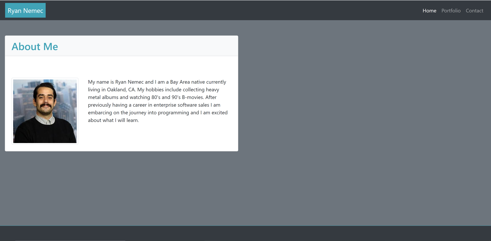
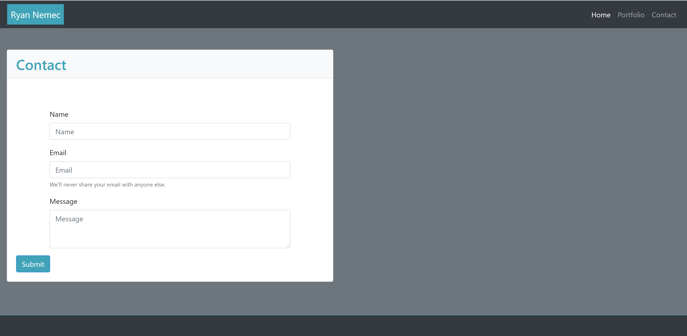
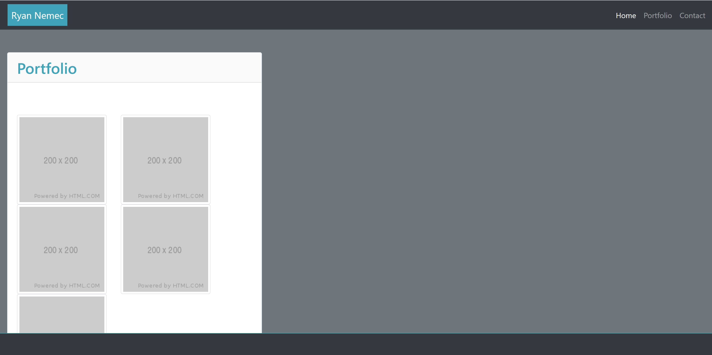

# Ryan-Portfolio

I created a website using HTML, CSS and utilzing my knowledge of Bootstrap. I created a navigation bar with working links to the other pages. I created a card displaying my image and information about myself. I also created ways to display my portfolio and a form in which potential employers can contact me. 

### Screenshots








### Installing

A step by step series of examples that tell you how to get a development env running

Say what the step will be

```
Give the example
```

And repeat

```
until finished
```

End with an example of getting some data out of the system or using it for a little demo


## Built With

* [HTML](https://developer.mozilla.org/en-US/docs/Web/HTML)
* [CSS](https://developer.mozilla.org/en-US/docs/Web/CSS)
* [Javascript](https://developer.mozilla.org/en-US/docs/Web/JavaScript)

## Deployed Link

* [See Live Site](#)


## Authors

* **YOUR NAME** 

- [Link to Portfolio Site](#)
- [Link to Github](https://github.com/)
- [Link to LinkedIn](https://www.linkedin.com/)

See also the list of [contributors](https://github.com/your/project/contributors) who participated in this project.

## License

This project is licensed under the MIT License 

## Acknowledgments

* Hat tip to anyone whose code, libraries, packages, or UI was used  / inspired from
* Inspiration
* etc
